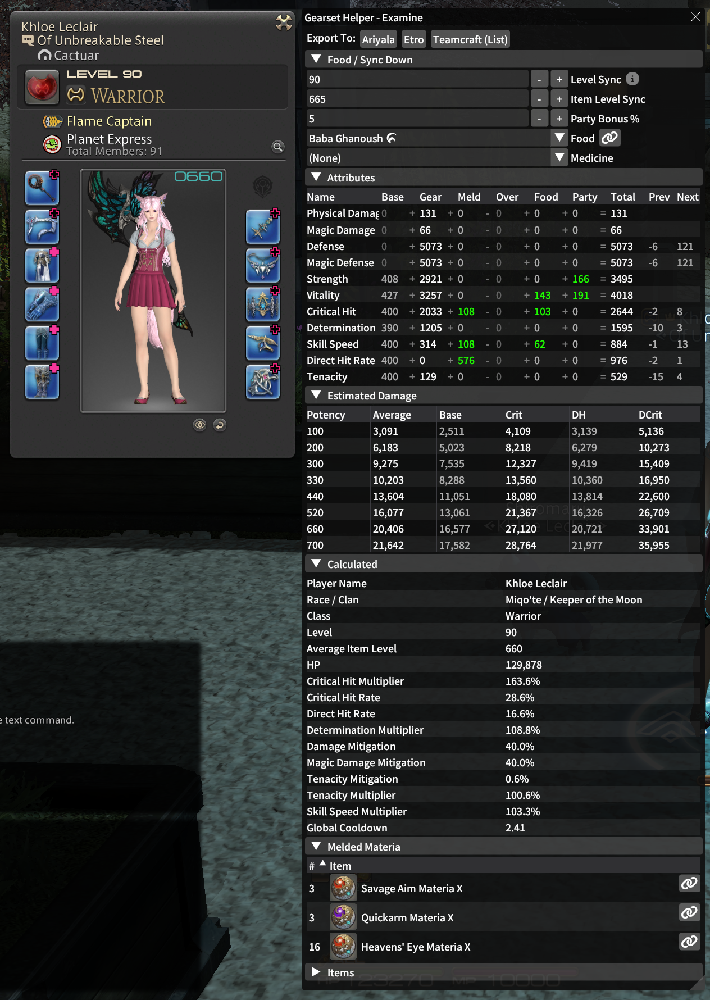

# Gearset Helper Plugin

Displays extra information next to the Character and Examine windows, including:

* Stat Breakdown + Tiering
* with Applied Food / Medicine
* Estimated Level-Synced Stats
* Melded Materia Count
* Per-Item Meld Breakdowns including Caps

Additionally, you can quickly and easily export gearsets to either
Etro.gg or Ariyala. Though, in the case of Etro you will need to
enter your API key.

You can export gear to a Teamcraft list as well, but if you want a
Teamcraft gearset you will currently need to export to Etro or
Ariyala first and then import from that to Teamcraft.

## Screenshots

